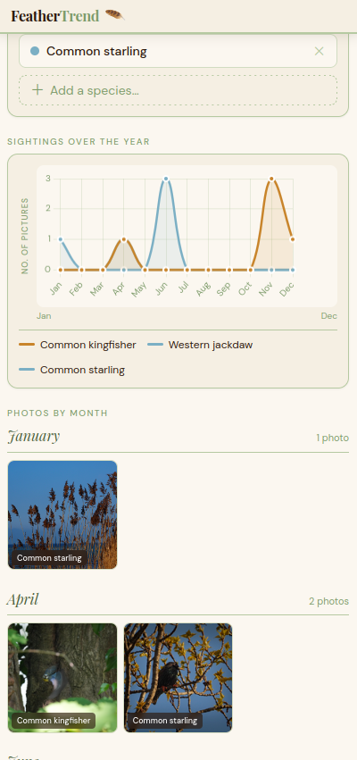

# FeatherTrend

Visualize bird phenology through a collection of timestamped pictures. A graph displays species abundance by month, and pictures are shown for each corresponding month:

Bonus feature: identify any bird picture with an embedded ML model. Register and click on **Identify a Bird**:

## WebApp
The PHP/Symfony backend serves the species list, count per month, and pictures. It uses a PostgreSQL database configured via the `DATABASE_URL` environment variable.
For species identification, the app uses the [Birder](https://gitlab.com/birder/birder) PyTorch model converted to ONNX format, which runs in PHP via the *ankane/onnxruntime* package.

### Run locally
Requirements:
 * Running postgres server
 * PHP with FFI enabled (Have a look at the  [Dockerfile](tests/Dockerfile.php)!)
 * Working composer binary
 * Installed Symfony

Then, install the dependencies with `composer install` and run a local server `symfony server:start`.

## Ingesting data
FeatherTrend expects data in two SQL tables:
1. `species`: `id|scientific_name|common_name`
2. `pictures`: `id|datetime|path|species_id`

Have a look at the [schema](app/migrations/create_db_schema.sql) and [test fixtures](app/tests/fixtures.sql) for more details

When running locally, you can add your pictures manually or use an automatic species identification approach, as described [here](data-pipeline/Readme.md).

## Live demo
[Click here!](https://feathertrend.gregoiredelannoy.fr)
