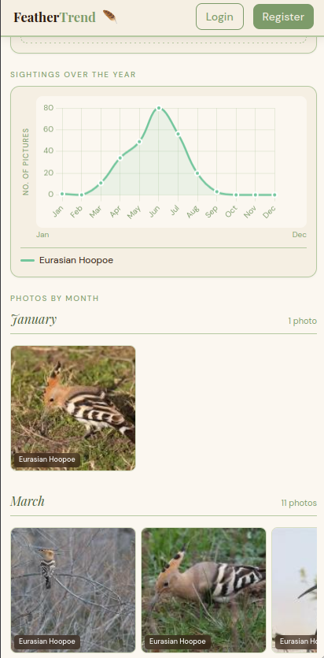
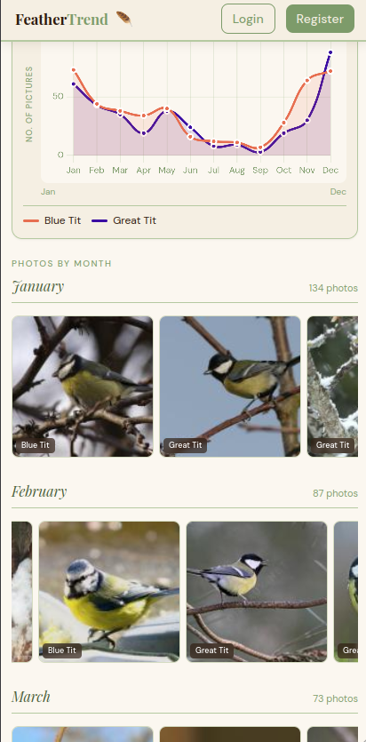
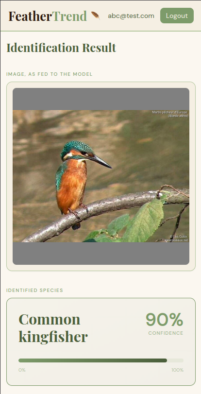

# FeatherTrend

FeatherTrend is a web app that tracks bird sightings over time using crowd-sourced images and on-device ML.

[Click here to see it live!](https://feathertrend.gregoiredelannoy.fr)

Some birds migrate out of the country, some of them are more active during certain times of years. The study of these seasonal changes is called phenology, and often involves knowledgeable experts studying a species in a given area.

This app takes another approach: using publicly posted images, we identify the species using a local ML model. Then, we can plot the number of sightings against the time of year.

Here we see the Eurasian Hoopoe with a typical migratory pattern:



On the other hand, Blue and Great Tits pictures are taken throughout the entire year, with a clear dip in late summer when the reproductive season is finished and the birds are more discreet:




The embedded ML model is also available on the webapp. Register on the live demo and click on **Identify a Bird**:




## Technical overview
```
Data Ingestion -> PostgreSQL -> PHP Backend with Symfony -> Vanilla JS frontend
```

The backend serves the species list and count per month from the PostgreSQL DB. Pictures and their thumbnails are served from the local filesystem.

The frontend is mostly vibe-coded plain HTML/CSS/JS with no framework.

For species identification, the app uses a [Birder](https://gitlab.com/birder/birder) PyTorch model converted to ONNX format, which runs in PHP via the *ankane/onnxruntime* package.

### Run locally
Requirements:
 * Postgres server
 * PHP with FFI enabled (Have a look at the  [Dockerfile](tests/Dockerfile.php)!)
 * Working composer binary
 * Installed Symfony CLI

Then, install the dependencies with `composer install` and run a local server `symfony server:start`. The `DATABASE_URL` environment variable has to be set.


### Testing
To run the integration + unit test suite, fire up `php bin/phpunit` from within the `app` directory.

The suite also runs in Docker: `docker compose -f tests/docker-compose.yml run --rm test-php`

See the results from the Github Action: [](https://github.com/GregoireDelannoy/FeatherTrend/actions/workflows/tests.yml)

### Data
FeatherTrend expects data in two tables:
1. `species`: `id|scientific_name|common_name`
2. `pictures`: `id|datetime|path|species_id`

Have a look at the [schema](app/migrations/create_db_schema.sql) and [test fixtures](app/tests/fixtures.sql) for more details

When running locally, you can add your pictures manually or use an automatic species identification approach, as described [here](data-pipeline/Readme.md).